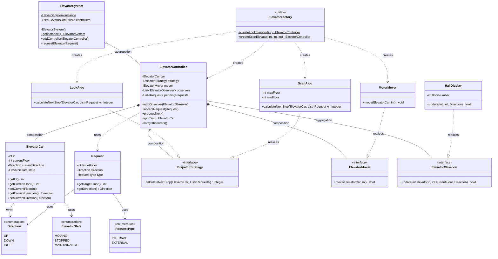

# 🛗 Elevator System

A multi-elevator management system built in Java, designed around clean OOP principles with pluggable dispatch strategies, observer-based displays, and a Singleton system coordinator.

---

## 📋 Table of Contents

- [Overview](#overview)
- [Features](#features)
- [Design Patterns Used](#design-patterns-used)
- [Class Diagram](#class-diagram)
- [File Structure](#file-structure)
- [Architecture](#architecture)
- [How It Works](#how-it-works)
- [Getting Started](#getting-started)
- [Sample Output](#sample-output)
- [Extending the System](#extending-the-system)

---

## Overview

This system simulates a real-world elevator network. Multiple elevator cars can be registered with a central `ElevatorSystem`, each controlled independently by an `ElevatorController`. Dispatch algorithms (LOOK, SCAN) determine the next floor to service, while floor displays are notified of movement via the Observer pattern.

---

## Features

- ✅ Singleton `ElevatorSystem` — one central coordinator for the whole building
- ✅ Multi-elevator support via pluggable `ElevatorController` instances
- ✅ External (hall) and Internal (cabin) request types
- ✅ Pluggable dispatch strategies: **LOOK** and **SCAN** algorithms
- ✅ Observer-based `HallDisplay` updates on every floor movement
- ✅ Factory-based elevator creation — pre-wired with strategy and mover
- ✅ Motor simulation with floor-by-floor movement and configurable delays
- ✅ Elevator state tracking: MOVING / STOPPED / MAINTENANCE

---

## Design Patterns Used

| Pattern | Where Used | Purpose |
|---|---|---|
| **Singleton** | `ElevatorSystem` | One global system instance manages all elevators |
| **Strategy** | `DispatchStrategy` → `LookAlgo`, `ScanAlgo` | Swap floor-selection algorithms at runtime |
| **Observer** | `ElevatorObserver` → `HallDisplay` | Notify floor displays when elevator position changes |
| **Factory** | `ElevatorFactory` | Pre-wires car + strategy + mover into a ready controller |
| **Composition** | `ElevatorController` owns `ElevatorCar`, `DispatchStrategy`, `ElevatorMover` | Controller fully manages its dependencies |

---

## Class Diagram



---

## Relationship Legend

| Notation | Type | Meaning |
|---|---|---|
| `*--` | **Composition** | Child cannot exist without parent; parent controls lifecycle |
| `o--` | **Aggregation** | Child can exist independently; parent holds a reference |
| `..|>` | **Realization** | Concrete class implements an interface |
| `..>` | **Dependency** | One class uses another transiently (method param / return) |
| `-->` | **Association** | One class references another as a persistent field |

---

## File Structure

```
src/
├── Main.java                             # Entry point — wires system, creates elevators, sends requests
│
├── controller/
│   └── ElevatorController.java           # Core controller: accepts requests, drives movement, notifies observers
│
├── enums/
│   ├── Direction.java                    # UP / DOWN / IDLE
│   ├── ElevatorState.java                # MOVING / STOPPED / MAINTAINANCE
│   └── RequestType.java                  # INTERNAL (cabin button) / EXTERNAL (hall button)
│
├── factories/
│   └── ElevatorFactory.java              # Factory: pre-wires car + strategy + mover into a controller
│
├── models/
│   ├── ElevatorCar.java                  # Physical elevator state: floor, direction, state
│   └── Request.java                      # Represents a floor request with direction and type
│
├── mover/
│   ├── ElevatorMover.java                # Interface: move(car, targetFloor)
│   └── MotorMover.java                   # Simulates floor-by-floor movement with Thread.sleep()
│
├── observer/
│   ├── ElevatorObserver.java             # Interface: update(elevatorId, currentFloor, direction)
│   └── HallDisplay.java                  # Displays elevator position on a specific floor's panel
│
├── strategies/
│   ├── DispatchStrategy.java             # Interface: calculateNextStop(car, pendingRequests)
│   └── impl/
│       ├── LookAlgo.java                 # LOOK: services requests in current direction before reversing
│       └── ScanAlgo.java                 # SCAN: sweeps floor range end-to-end, bounded by min/max floor
│
└── system/
    └── ElevatorSystem.java               # Singleton: manages all controllers, routes external requests
```

---

## Architecture

```
┌──────────────────────────────────────────────────────────┐
│               ElevatorSystem  (Singleton)                │
│     requestElevator() → picks best ElevatorController    │
└───────────────────────┬──────────────────────────────────┘
                        │  aggregation
           ┌────────────▼──────────────────┐
           │       ElevatorController      │
           │                               │
           │  *── ElevatorCar              │  (composition)
           │  *── DispatchStrategy         │  (composition)
           │       ├── LookAlgo            │
           │       └── ScanAlgo            │
           │  *── ElevatorMover            │  (composition)
           │       └── MotorMover          │
           │  o── ElevatorObserver[]       │  (aggregation)
           │       └── HallDisplay         │
           └───────────────────────────────┘
```

---

## How It Works

### External Request (Hall Button)
1. A passenger presses UP on a floor → `Request(floor, Direction.UP, EXTERNAL)`.
2. `ElevatorSystem.requestElevator()` picks the best controller (currently first available).
3. `ElevatorController.acceptRequest()` queues the request in `pendingRequests`.
4. `processNext()` calls `DispatchStrategy.calculateNextStop()` to determine the target floor.
5. `ElevatorMover.move()` simulates floor-by-floor travel.
6. All registered `ElevatorObserver` instances (e.g. `HallDisplay`) are notified on arrival.
7. The fulfilled request is removed from the queue.

### Internal Request (Cabin Button)
1. A passenger presses a floor inside the cabin → `Request(floor, Direction.IDLE, INTERNAL)`.
2. Added directly via `elevator.acceptRequest()` — bypasses the `ElevatorSystem` dispatcher.
3. Follows the same `processNext()` → strategy → mover → observer flow.

---

## Getting Started

### Prerequisites
- Java 11 or higher

### Compile & Run

```bash
# From the project root
javac -d out $(find src -name "*.java")
java -cp out Main
```

---

## Sample Output

```
Initializing Elevator System...
Elevator 1 accepted request for floor 1
Calculating next stop using Look algorithm....
Elevator 1 starting motor...
Elevator 1 arrived at floor 1
[Display Floor 1] Elevator 1 is now at floor 1 going UP
[Display Floor 5] Elevator 1 is now at floor 1 going UP
Opening doors at floor 1
Elevator 1 accepted request for floor 5
Calculating next stop using Look algorithm....
Elevator 1 starting motor...
Elevator 1 arrived at floor 5
[Display Floor 1] Elevator 1 is now at floor 5 going IDLE
[Display Floor 5] Elevator 1 is now at floor 5 going IDLE
Opening doors at floor 5
```

---

## Extending the System

### Add a New Dispatch Algorithm

Implement `DispatchStrategy`:

```java
public class FIFOStrategy implements DispatchStrategy {
    @Override
    public Integer calculateNextStop(ElevatorCar car, List<Request> pending) {
        return pending.isEmpty() ? null : pending.get(0).getTargetFloor();
    }
}
```

### Add a New Mover (e.g., cable simulation)

Implement `ElevatorMover`:

```java
public class CableMover implements ElevatorMover {
    @Override
    public void move(ElevatorCar car, int targetFloor) throws InterruptedException {
        // Custom physics/timing simulation
    }
}
```

### Add a New Observer (e.g., mobile push notification)

Implement `ElevatorObserver`:

```java
public class MobileNotifier implements ElevatorObserver {
    @Override
    public void update(int elevatorId, int currentFloor, Direction direction) {
        // Send push notification
    }
}
```

### Register a SCAN Elevator

```java
ElevatorController scanElevator = ElevatorFactory.createScanElevator(2, 1, 20);
scanElevator.addObserver(new HallDisplay(10));
system.addController(scanElevator);
```